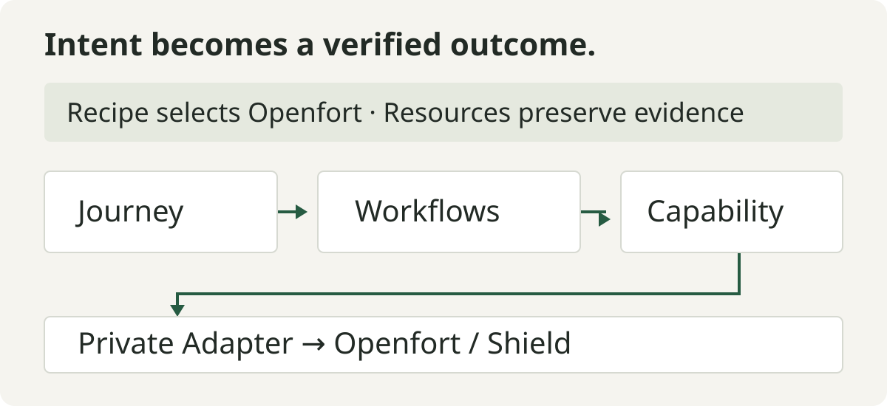

# Onli Wallet · Openfort

**A working wallet demo and a code guide to building with Onli’s architecture.**

Run the leather wallet UI locally, then follow the code from a versioned Recipe
through shared Tools and Workflows to the send Journey. Openfort provides the
external wallet implementation; Onli’s digital-thing model remains distinct from
blockchain records.

[Live demo](https://onli-openfort-wallet.fly.dev/) · [Run locally](#run-locally) · [Read the implementation report](docs/ARCHITECTURE.md) · [Review the code audit](docs/ONLI_CONFORMANCE_REVIEW.md)

## What you can explore

- **Wallet UI:** member/admin views, receive QR, fee review, explicit send confirmation and activity.
- **Openfort integration:** recover the exact issued account, renew short-lived access and tear down isolated sessions.
- **Encrypted portability:** canonical encrypted backup creation and approved temporary opening.
- **Operation recovery:** preserve pending or uncertain effects instead of blindly sending again.
- **Claude skill:** required Recipe input, Owner authentication and behavior-authorization requirements in [.claude/skills/onli-send-funds](.claude/skills/onli-send-funds/SKILL.md).

**Verified locally:** 138 tests passed, plus architecture checks, lint, formatting,
TypeScript and production build. This is local contract evidence, not a live-provider
certification. See [verification](docs/VERIFICATION.md).

## Run locally

Use **Node 26.5.0** and **npm 11.17.0**. The toolchain and dependencies are pinned.

```sh
git clone https://github.com/syn-S2B/openfortWallet.git
cd openfortWallet
nvm install
nvm use
npm ci
npm run demo
```

Open **[the wallet](http://127.0.0.1:5175/)**. No credentials are required for the
visual demo; sign-in and protected wallet actions remain unavailable in that mode.
It ignores inherited Species credentials and external environment files.

The running site includes two connected Docs pages:

1. [Concepts and the build guide](https://onli-openfort-wallet.fly.dev/Docs/index.html) — Onli, Tools, Workflows, Journeys, Recipes, Resources and provider integration.
2. [The Openfort code walkthrough](https://onli-openfort-wallet.fly.dev/Docs/openfort-walkthrough.html) — actual source excerpts showing how the wallet is assembled.

These guides are also available locally after starting the app. Their source lives
in [public/Docs](public/Docs). The [Fly.io deployment](docs/FLY_DEPLOYMENT.md) is
a credential-free public demo; real-wallet operations are disabled.

## How it fits together



**The Recipe selects the provider binding.** The Journey owns the outcome;
Workflows compose reusable work; Tools enforce bounded contracts. A Capability
exposes the stable operation, and its private Adapter translates to Openfort.
Resources retain wallet identity, exact intent, operation state and evidence.

The send path reviews the exact transfer, requires explicit confirmation, persists
continuity before broadcast and verifies matching transaction/receipt evidence.
A hash means pending. A lost response remains indeterminate and blocks replacement.
Completion currently means matching inclusion, not irreversible finality.

## Connect real services

Follow [the integration guide](docs/BUILD_INTEGRATION.md) and
[Species gateway contract](docs/GATEWAY_CONTRACT.md). This checkout includes the
client and local Node proxy; Species, Onli, Openfort and Shield backend services
are external.

Keep the administrator-issued Species configuration in a protected environment file
**outside this repository**:

```sh
SPECIES_WALLET_ENV_FILE=/absolute/path/to/protected/wallet.env npm run dev
```

The browser receives only permitted publishable keys and temporary access material.
Service secrets stay server-side. Never use a `VITE_` prefix for credentials.
The personal wallet path supports Ethereum mainnet/Sepolia EOAs and requires ETH
for gas; automatic treasury sweeps and a general asset bridge are not implemented.

## Verify your changes

```sh
npm run check
npm run check:security
npm run check:licenses
```

`check` runs standalone/architecture validation, lint, new-layer formatting, Node
tests, TypeScript and Vite build. GitHub and Gitea CI are configured. Remote-runner results are separate from
the local evidence above. The pinned ethers/Openfort dependency tree retains nine low-severity
advisories; forced incompatible SDK changes were not applied.

<details>
<summary><strong>Source map</strong></summary>

| Location | Responsibility |
| --- | --- |
| [src/journey](src/journey) | Caller-visible outcomes and recovery duties |
| [src/workflow](src/workflow) | Shared preparation, recovery, execution and reconciliation |
| [src/tool](src/tool), [src/contracts](src/contracts), [src/resource](src/resource) | Validation, authority/evidence contracts and durable metadata |
| [src/recipe](src/recipe) | Versioned provider, network and timing definitions |
| [src/capability](src/capability), [src/adapter](src/adapter) | Stable operations and private integrations |
| [server](server) | Allowlisted Species proxy, authenticated envelope and secret isolation |
| [tests](tests) | Synthetic fixtures and layered contract/composition/UI checks |

</details>

## Before production

General backend Onli `AuthorizeBehavior` enforcement for sends and application-level
encryption of protected continuity metadata still need integration. Live service
behavior, provider-side encryption at rest, stronger finality and remote CI remain
unverified. A skill does not implement missing enforcement. No real account was
provisioned, key released or transaction submitted during this work.

## Public-source hygiene and provenance

This public repository starts from a reviewed snapshot, without the original private
Git history. Account IDs in tests are synthetic. The known test-key address is a
fixture; published USDC addresses are public token contracts, not customer accounts.
No real Openfort account/project identifiers, real account numbers or service
credentials were identified by the publication scans.

See [source provenance](docs/SOURCE_PROVENANCE.md),
[troubleshooting](docs/TROUBLESHOOTING.md) and [site audit](docs/SITE_AUDIT.md).
Source visibility does not grant an open-source license: no project license has
been selected. Third-party SDKs and branding retain their own rights and licenses.
